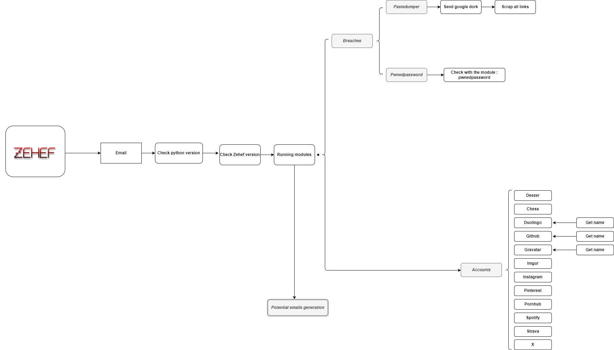

<h1 align="center" id="title">Z e h e f</h1><br>


[](https://www.python.org/downloads/)
[](https://www.gnu.org/licenses/gpl-3.0.fr.html)

# **Zehef is an osint tool who studies the emails 📩**

# **😇 Abouts zehef**

> Zehef v2 is a tool focused on finding public information on a targeted email.

## 🌠 Features

- Check if the email is in a paste ([Pastebin](https://fr.wikipedia.org/wiki/Pastebin.com))
- Check if the email is pwned 
- Lists the sites to which the email address is connected (chess, deezer, duolingo, github, gravatar, instagram ...)
- Generate email combinations


### 🔎 Zehef Workflow



## **📦 Installation**

- [Python 3.10+](https://www.python.org/downloads/)
- [Git](https://git-scm.com/downloads)

```
$ git clone https://github.com/N0rz3/Zehef.git
$ cd ./Zehef
$ pip3 install -r requirements.txt
```

## **🎲 Usage**

```
usage: zehef.py [-h] [email]

positional arguments:
  email       Search informations on email (breaches, pastes, accounts ...)

options:
  -h, --help  show this help message and exit
```

### `$ python3 zehef.py email@domain.com `

## **🌞 More**


### **✔️ / ❌ Rules**

- **This tool was designed for educational purposes only and is not intended for any mischievous use, I am not responsible for its use.**


### **📜 License**

- **This project is [License GPL v3](https://www.gnu.org/licenses/gpl-3.0.fr.html) be sure to follow all rules 👍**

### **💖 Thanks**
- If you like what i do please subscribe 💖. And if you find this tool is useful don't forget to star 🌟

- 💶 Support me 👇

<a href="https://www.buymeacoffee.com/norze" target="_blank"></a> 